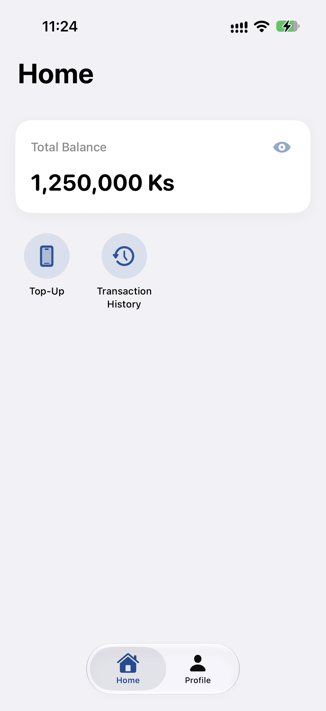
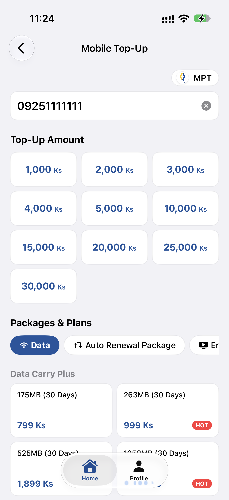
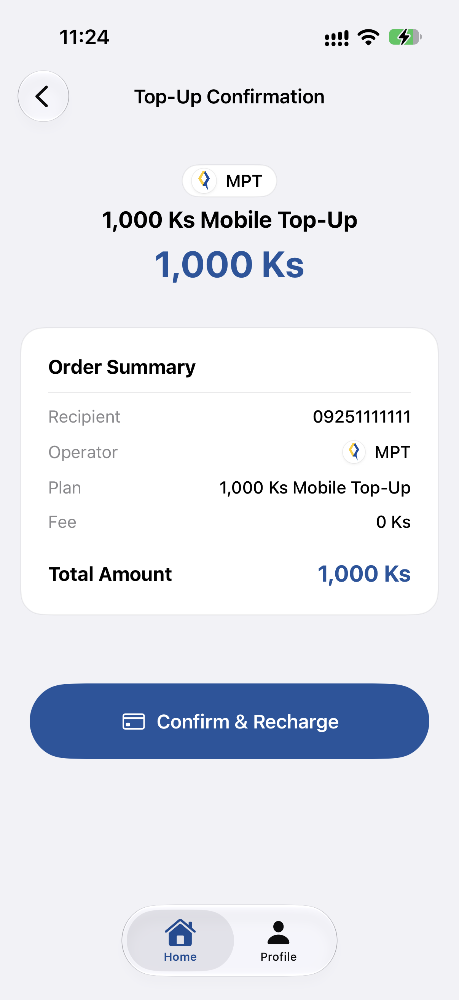
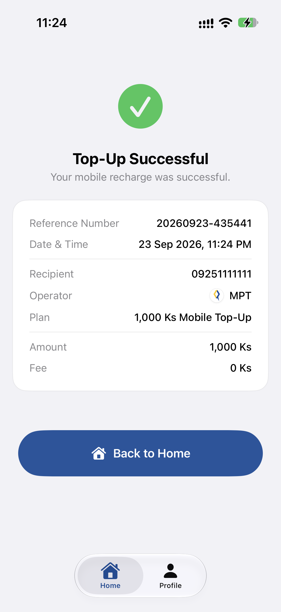
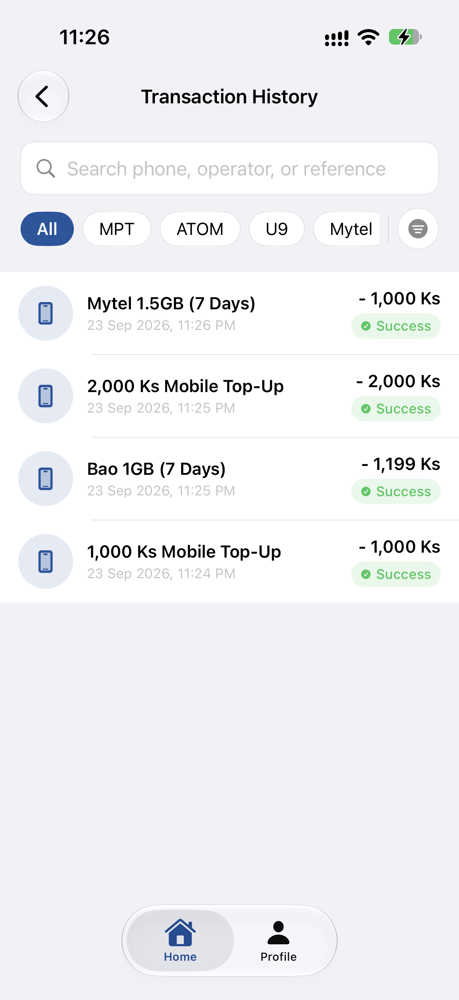
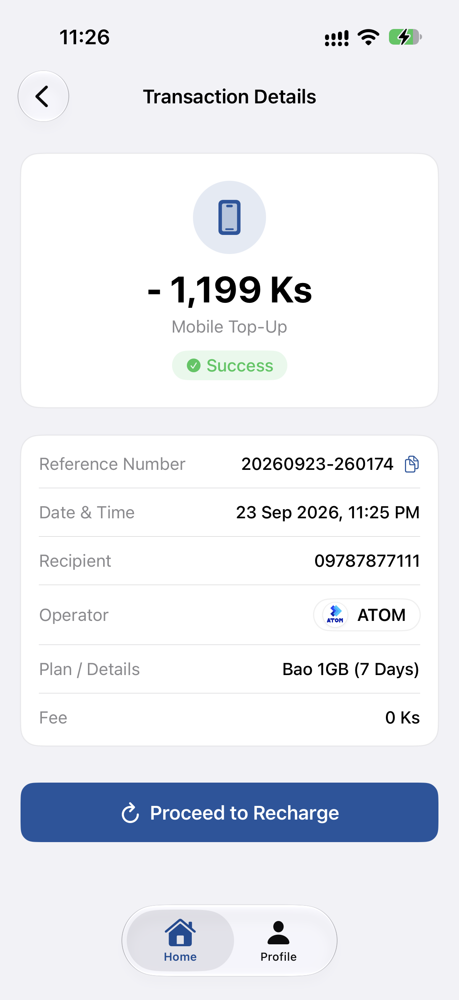

# myWallet

myWallet is a SwiftUI mobile wallet prototype focused on mobile top-up, telecom operator detection, package selection, recharge confirmation, and transaction history.

## Screenshots

The main user flow is shown below:

<table>
  <tr>
    <td align="center" width="33%"><strong>Home</strong><br></td>
    <td align="center" width="33%"><strong>Top Up</strong><br></td>
    <td align="center" width="33%"><strong>Confirmation</strong><br></td>
  </tr>
  <tr>
    <td align="center" width="33%"><strong>Success</strong><br></td>
    <td align="center" width="33%"><strong>History</strong><br></td>
    <td align="center" width="33%"><strong>Details</strong><br></td>
  </tr>
</table>

## Features

- SwiftUI interface with responsive iPhone and iPad layouts
- Protocol-oriented MVVM-R architecture with Repository Pattern
- SwiftData persistence for telecom prefixes, package catalogs, and transactions
- Offline telecom prefix detection from the local cache
- Network-first catalog synchronization with SwiftData fallback
- Recharge success receipt and transaction history
- Search, filtering, and sorting for transaction history
- Light and dark mode support
- English and Burmese localization
- Animated package transitions and interactive controls
- Portrait and landscape orientation support without reloading ViewModel state

## Requirements

- Xcode 16 or later
- iOS 17.6 or later
- Swift 5
- SwiftUI
- SwiftData

## Running the Project

1. Open `myWallet.xcodeproj` in Xcode.
2. Select the `myWallet` scheme.
3. Choose an iPhone or iPad simulator running iOS 17.6 or later.
4. Build and run with `⌘R`.

The app uses bundled JSON files as a mock network layer:

- `myWallet/Resources/MockData/telecom_prefixes.json`
- `myWallet/Resources/MockData/packages.json`

SwiftData is used for the local catalog cache and transaction history.

## Architecture

The project follows a protocol-oriented MVVM-R structure:

```text
View
  ↓
ViewModel  →  Router
  ↓
Repository
  ↓
Mock Network Service / SwiftData
```

### Main layers

- `Features/` — feature-specific views and ViewModels
- `Repositories/` — SwiftData access, caching, filtering, and synchronization
- `Services/` — mock network and external service abstractions
- `Models/` — SwiftData entities, DTOs, and domain enums
- `Core/` — routing, dependency composition, localization, theme, formatting, and constants
- `Components/` — reusable SwiftUI components

Dependencies are created by `AppContainer` and injected through protocols for testability.

## Data Flow

### Telecom detection

1. The user enters a mobile number.
2. The number is normalized locally, including Myanmar numerals and international prefixes.
3. The telecom prefix is matched offline against memory or SwiftData cache.
4. Packages are loaded for the detected operator.

### Package synchronization

1. The repository requests the latest package catalog from the mock network service.
2. Successful responses replace the local SwiftData catalog.
3. Network failures fall back to the in-memory cache or SwiftData.
4. If no cache exists, a typed error is exposed to the feature.

### Recharge

1. The selected recharge is submitted through `TopUpRepository`.
2. A successful response is converted into a `TransactionHistory` entity.
3. The transaction is saved through `TransactionRepository`.
4. The app navigates to the success receipt only after persistence succeeds.

## Testing

The test target uses Swift Testing for unit and repository tests, with in-memory SwiftData containers and protocol-based mocks.

Covered areas include:

- App container composition
- Router navigation
- Telecom number normalization and prefix matching
- Package and prefix cache fallback
- Recharge and transaction persistence flow
- Transaction filtering, search, and date ranges
- ViewModel state and navigation behavior
- Date, currency, reference number, theme, and localization helpers

Run tests from Xcode with `⌘U` or from the command line:

```bash
xcodebuild test \
  -project myWallet.xcodeproj \
  -scheme myWallet \
  -destination 'platform=iOS Simulator,name=iPhone 16'
```

## Project Structure

```text
myWallet/
├── App/
├── Components/
├── Core/
├── Features/
│   ├── History/
│   ├── Home/
│   ├── Profile/
│   └── TopUp/
├── Models/
├── Repositories/
├── Resources/
└── Services/
```

## Notes

This project uses a mock network service and bundled JSON data so the complete top-up flow can be demonstrated without external credentials or a live backend.
